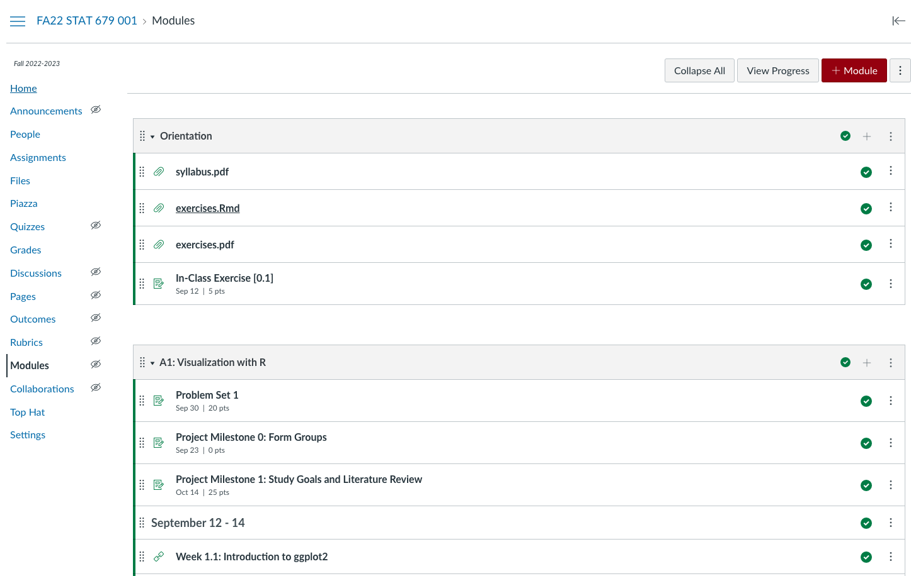

# STAT 679 / 992: Statistical Data Visualization

## Fall 2023

```{r setup, include=FALSE}
library(tidyverse)
library(knitr)
opts_chunk$set(
  echo = TRUE,
  message = FALSE,
  warning = FALSE,
  cache = TRUE,
  dpi = 200,
  fig.align = "center",
  out.width = 650,
  fig.height = 3,
  fig.width = 9
  )
th <- theme_minimal() +
  theme(
    panel.grid.minor = element_blank(),
    panel.background = element_rect(fill = "#f7f7f7"),
    panel.border = element_rect(fill = NA, color = "#0c0c0c", size = 0.6),
    axis.text = element_text(size = 14),
    axis.title = element_text(size = 16),
    legend.position = "bottom"
  )
theme_set(th)
options(width = 100)
```

---

# September 7, 2023

1. Review syllabus
1. Review class resources
1. In-Class Exercise 0.1

---

### Welcome!!

I'm excited to share this course with you this semester. There are few
activities that engage creative, quantitative, and critical thinking skills all
at once, but data visualization is one of them.

Nothing makes my day like a good data visualization, and I look forward to
seeing those that you create.

---

### Syllabus

* Learning outcomes
* Teaching team and office hours
* Assessments
* Grading

---

### Learning Outcomes

In this class, you will learn to...

1. Draw from a **catalog of visual encodings** to support specific visual comparisons in temporal, geospatial, network, hierarchical, high-dimensional count, text, and uncertain data and demonstrate facility implementing them using the R and javascript programming languages.
2.	Draw from a **catalog of interactivity patterns** to compose visualizations that
respond to user’s dynamic queries.
3.	Using the vocabulary of data visualization, **analyze and critique visual designs**.

---

### Learning Outcomes

In this class, you will learn to...

4.	Given a data analysis problem and initial design solution, iteratively **refine visual encodings and interactivity** idioms from across the design space until a satisfactory solution is discovered.
5.	**Navigate the data visualization research literature**, summarize the contributions of a specific methodological proposal, and evaluate their applicability in specific problem contexts.

---

### Office Hours

We will announce in-person and virtual office hours depending on the results of
this poll: https://go.wisc.edu/93oh27

---

### Assessments

* In-class exercises and discussions graded for completeness
* 4 problem sets 
* 3 group project reports and 1 presentation
  - Teams of 4 - 5 people
* 1 midterm exam

---

### Grading

* Problem Sets: 35%
* Group Project: 25%
* In-Class Exercises: 20%
* Midterm: 20%

---

### Canvas Page Walkthrough

```{r, echo = FALSE}

```

---

### Class Resources

1. [Canvas page](https://canvas.wisc.edu/courses/374041)
  - Links to all other resources
1. [Readings](https://drive.google.com/file/d/16jr5MlX8axfDVZ3kS4vZuWzqDOpj1Wng/view?usp=sharing)
1. [Exercises](https://canvas.wisc.edu/courses/374041/files?preview=33640181)
1. [Online notes](https://krisrs1128.github.io/stat992_f23/website/docs/)
1. [Online recordings](https://mediaspace.wisconsin.edu/) (also linked in notes)

---

### Last Year's Course Reflections

* [https://go.wisc.edu/vwie77](https://go.wisc.edu/vwie77)

---

### Questions?

Also feel free to speak with me after class.

---

### Send me visualizations

If over the course of the semester you find a data visualization that you think
might be interesting to the class, send me a link! There's a lot that can be
learned through imitation.

Examples: 
* https://book.rwithoutstatistics.com/data-viz-chapter.html
* https://ijeamaka.art/portfolio/radial_patterns/
* https://observablehq.com/@visionscarto/potential-dollar-flows?collection=@visionscarto/30daymapchallenge
* http://nbremer.github.io/urbanization/

---

### Exercise 0.1

1. Introduce yourself to at least two people who you do not already know.

1. Submit a response to [Formulating Questions] in the exercise sheet.

1. Share your chosen datasets in small groups.

[Formulating Questions] Pick a dataset from
[TidyTuesday](https://github.com/rfordatascience/tidytuesday#datasets), [Data Is
Plural](https://docs.google.com/spreadsheets/d/1wZhPLMCHKJvwOkP4juclhjFgqIY8fQFMemwKL2c64vk/edit#gid=0),
[Kaggle Datasets](https://www.kaggle.com/datasets), [Google Dataset
Search](https://datasetsearch.research.google.com/), or your own personal
studies that you would like to visualize this semester. What makes you
interested in this dataset? Please provide a link, so we can refer to the data in future sessions.

---

# September 12, 2023

1. Exercise review
1. Code demo [City Temperatures]
1. In-Class Exercise 1.1

---

### Announcements

1. Office hours will be held ... 

These
sessions will be hybrid -- you can join in person at MSC 7225C or through Zoom.

1. The description for how to form groups is in Project Milestone 0. If you do
not form a team by the deadline, you will be randomly assigned one.

1. Problem set 1 is online.

1. Project Milestone 0 (Forming Groups) is due on September 18.

---

### Exercise Review

Let's analyze the exercise results together.

[https://go.wisc.edu/fzn067](https://go.wisc.edu/fzn067)

---

### In-Class Demo 1.1

[https://go.wisc.edu/fzn067](https://go.wisc.edu/fzn067)

---

### Exercise 1.1

The data below measures properties of various Antarctic penguins.

```{r, echo = TRUE}
penguins <- read_csv("https://uwmadison.box.com/shared/static/ijh7iipc9ect1jf0z8qa2n3j7dgem1gh.csv")
```

Create a single plot that makes it easy to answer both of these questions,
(i) How is bill length related to bill depth within and across species? (ii)
On which islands are which species found?

Read about [Simpson's
paradox](https://en.wikipedia.org/wiki/Simpson%27s_paradox) and summarize it
in your own words. Then, explain how part (i) provides a real-world example
of this paradox.

If you finish early -- can you think of an alternative encoding that
visualizes the same information? How do the encodings compare and contrast
with one another?

---

# September 14, 2023

1. Exercise review
1. Code demo [Plant growth]
1. (If Time) Discussion [When2meet]
1. [In-Class Exercise 1.2]

---

### Exercise Review

